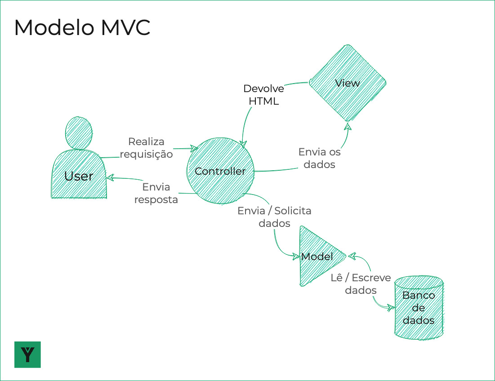
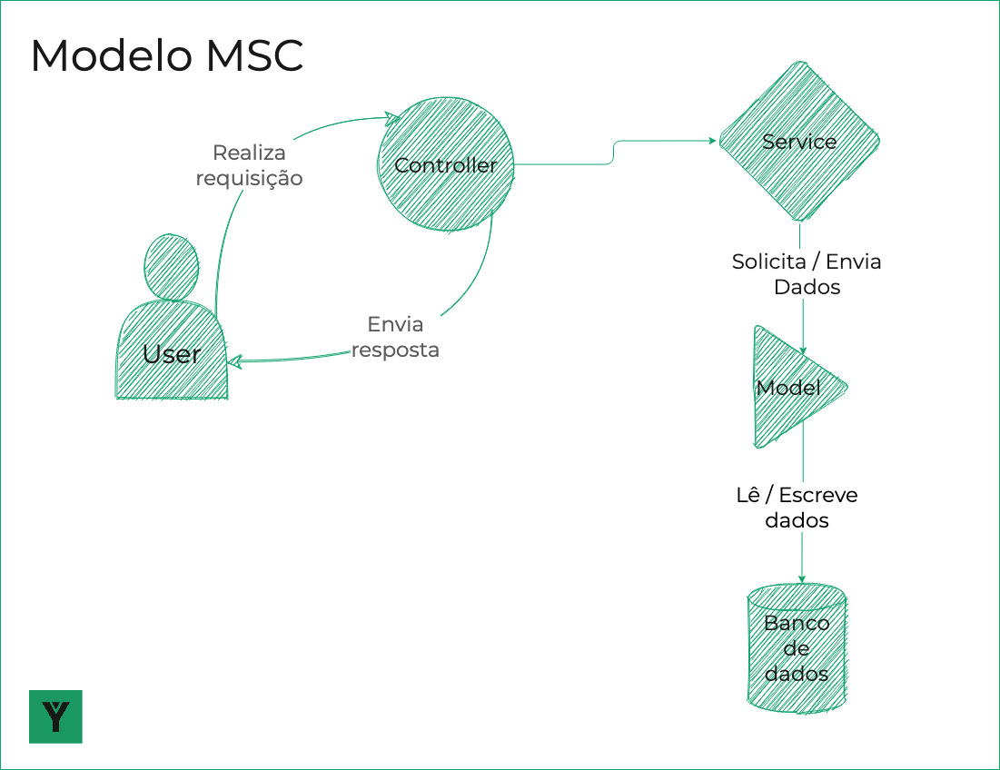

<!-- slide -->

# Catch-up

# 27.2 + 28.1

<!-- slide -->

# MVC

<!-- slide vertical=true -->

## O que é o MVC

<!-- slide vertical=true -->

Modelo de arquitetura **monolítica** composta por três camadas:

- Model

- View

- Controller

<!-- slide vertical=true -->

### Model

Responsável por toda a comunicação com o banco de dados, bem como pelas regras de negócio

<!-- slide vertical=true -->

### View

Responsável pela formatação e visualização dos dados

<!-- slide vertical=true -->

## Controller

Responsável por receber requisições e comunicar-se com View e Model para atendê-las

<!-- slide vertical=true -->

## Fluxo de dados no MVC

<small>

1. Cliente realiza uma requisição, que é recebida pelo Controller

1. Controller solicita ao model os dados necessários

1. Model comunica-se com o banco para obter os dados solicitados pelo controller

1. Controller utiliza os dados recebidos do model para renderizar a View

1. Controller envia a view renderizada de volta para o cliente

</small>

<!-- slide vertical=true -->

## Visualizando o fluxo

<!-- slide -->

# MSC

<!-- slide vertical=true -->

## O que é o MSC

<!-- slide vertical=true -->

Modelo de arquitetura **desacoplada** composta por três camadas:

- Model

- Service

- Controller

<!-- slide vertical=true -->

### Model

Responsável por toda a comunicação com o banco de dados

<!-- slide vertical=true -->

### Service

Responsável pela aplicação das **regras de negócio**

<!-- slide vertical=true -->

## Controller

Responsável por receber requisições e comunicar-se com o Service solicitando que sejam atendidas

<!-- slide vertical=true -->

## Fluxo de dados no MSC

<small>

1. Cliente realiza uma requisição, que é recebida pelo Controller

1. Controller trata os dados recebidos e solicita ao service que os processe

1. Service processa e valida os dados recebidos, enviando-os ou solicitando-os ao Model

1. Model comunica-se com o banco para obter ou armazenar os dados enviados pelo Service

1. Service devolve o resultado das operações ao Controller

1. Controller formata o resultado e envia a resposta para o cliente

</small>

<!-- slide vertical=true -->

## Visualizando o fluxo

